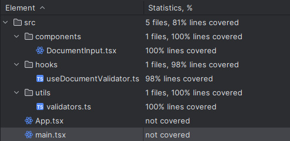
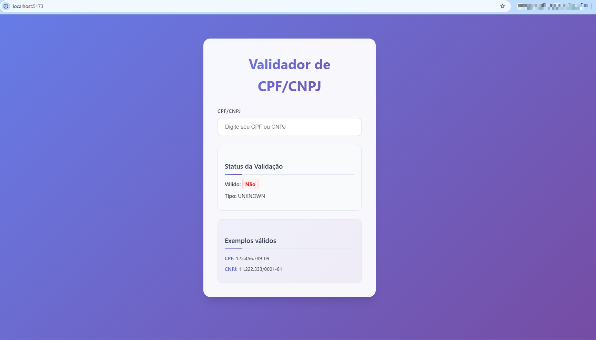

# React TDD
### Projeto exemplo usando TDD (Desenvolvimento Orientado a Testes)

Este projeto demonstra a implementação de **Test-Driven Development (TDD)** em React, criado para ensinar os conceitos fundamentais de TDD.

## Como começar
### Clonando o projeto

```bash
    git clone [URL_DO_REPOSITORIO]
    cd react-tdd-1-hora
```

### Instalação e execução

```bash
    # Instalar dependências
    npm install
    
    # Executar o projeto em modo desenvolvimento
    npm run dev
```

O projeto estará disponível em `http://localhost:5173`

## 🧪 Executando os testes

### Executar todos os testes
```bash
    npm run test
```

### Verificar cobertura de testes
```bash
    npm run coverage
```

### Executar testes em modo watch (desenvolvimento)
```bash
    npm run test:watch
```

## Resultados
### Cobertura de Testes

</br>
*Figura 1 - Relatório de cobertura dos testes*

### Aplicação em Funcionamento

</br>
*Figura 2 - Interface da aplicação*

## Lições aprendidas com projeto
- ✅ Conceitos fundamentais do TDD
- ✅ Configuração de ambiente de testes com Jest e React Testing Library
- ✅ Ciclo Red-Green-Refactor
- ✅ Escrita de testes unitários e de integração
- ✅ Boas práticas de teste em React

## Tecnologias utilizadas
- **React** - Biblioteca para construção da interface
- **Jest** - Framework de testes
- **React Testing Library** - Utilitários para teste de componentes React
- **Vite** - Build tool e servidor de desenvolvimento

## Estrutura do projeto

```
src/
├─ components/          
├── hooks/          
├── utils/              
├── assets/              
└── App.tsx             
test/
├─ components/          
├── hooks/          
└── utils/     
```

## Contribuindo

1. Faça um fork do projeto
2. Crie uma branch para sua feature (`git checkout -b feature/AmazingFeature`)
3. Commit suas mudanças (`git commit -m 'Add some AmazingFeature'`)
4. Push para a branch (`git push origin feature/AmazingFeature`)
5. Abra um Pull Request

## Licença

Este projeto está sob a licença MIT. Veja o arquivo [LICENSE](LICENSE) para mais detalhes.

---

**Desenvolvido por EmersonSantos exemplo de TDD em React**
